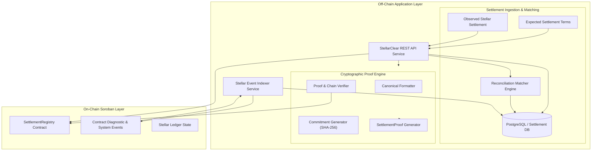

# StellarClear System Architecture

StellarClear is an open-source, Stellar-native settlement evidence and reconciliation protocol that provides cryptographic auditability for financial settlements executed on the Stellar network.

## Core Architectural Principles

1. **Strict Privacy Boundary**: Sensitive trade details (business counterparties, internal trade references, settlement instructions, and internal bookkeeping records) remain off-chain in private databases.
2. **Canonical Cryptographic Commitments**: Off-chain settlement terms, observed transactions, and dispute resolutions are transformed into deterministic SHA-256 commitments before being submitted to Soroban.
3. **On-Chain Evidence Anchoring**: The Soroban `SettlementRegistry` smart contract acts as the immutable global settlement truth layer, storing status transitions, cryptographic commitments, transaction references, and multi-party attestations.
4. **Independent Verifiability**: Any counterparty, auditor, regulator, or automated agent can independently verify a `SettlementProof` offline via canonical SHA-256 hashing or online against live Soroban contract state.

---

## Architectural Overview

---

## Monorepo Components

### 1. Packages

- **`packages/schemas`**: Canonical runtime-validated domain schemas using Zod in TypeScript strict mode. Contains domain models for `ExpectedSettlement`, `ObservedSettlement`, `ReconciliationResult`, `Break`, `Attestation`, and `SettlementProof`. Financial decimal amounts are stored as exact strings to prevent floating-point rounding errors.
- **`packages/proof`**: Canonical formatting (`formatDomainDocument`) and SHA-256 commitment computation (`computeTermsCommitment`, `computeObservationCommitment`, `computeResolutionCommitment`). Implements deterministic serialization invariant to JSON key order, as well as `createSettlementProof` and `verifySettlementProof`.
- **`packages/settlement-registry`**: Generated TypeScript bindings directly compiled from the Soroban `SettlementRegistry` smart contract wasm using Stellar CLI.
- **`packages/sdk`**: High-level TypeScript client SDK wrapping Soroban RPC submission, contract simulation, typed error normalization, and case operations (`SettlementRegistryOperations`).
- **`packages/db`**: Database persistence layer with SQL schema migrations, repository patterns for cases, observations, reconciliations, breaks, and attestations, supporting both PostgreSQL and in-memory test clients.

### 2. Services

- **`services/matcher`**: Strict financial reconciliation engine that compares expected instructions against observed on-chain transactions, evaluating exact decimal equality, destination match, asset match, deadline compliance, and returning detailed break diagnostics (`BreakCode`).
- **`services/indexer`**: Resilient ingestion service for Soroban contract events (`CaseCreated`, `CaseObserved`, `CaseMatched`, `CaseBroken`, `CaseAttested`, `CaseDisputed`, `CaseResolved`, `CaseFinalized`), maintaining idempotency and durable cursor tracking.
- **`services/api`**: Fast REST API service exposing case creation, observation recording, automated reconciliation, attestation management, dispute workflows, proof generation, and on-chain verification endpoints.

---

## Data Flow & Evidence Pipeline

1. **Instruction Ingestion**: Case terms are submitted to `POST /v1/cases`. The canonical terms commitment is calculated off-chain and anchored on Soroban via `create_case`.
2. **Transaction Observation**: The actual on-chain Stellar transaction is ingested via `POST /v1/cases/:caseId/observe`. The canonical observation commitment is computed and anchored on Soroban via `record_observation`.
3. **Automated Reconciliation**: The reconciliation matcher runs exact decimal and rule verification via `POST /v1/cases/:caseId/reconcile`. A match triggers `record_match`, whereas breaks trigger `record_break` with machine-readable break codes.
4. **Multi-Party Attestations**: Authorized participants submit cryptographic signatures/attestations via `POST /v1/cases/:caseId/attest`, anchoring confirmations on Soroban via `submit_attestation`.
5. **Dispute & Resolution (if broken)**: Disputed cases transition via `open_dispute` and `submit_resolution` with evidence and agreement commitments.
6. **Settlement Finalization**: Once matched or resolved, the case is sealed on-chain via `finalize_case`.
7. **Settlement Proof Generation & Verification**: A verifiable `SettlementProof` JSON package is exported via `GET /v1/cases/:caseId/proof`, which can be validated anywhere via `POST /v1/proofs/verify` or `POST /v1/proofs/verify/onchain`.
