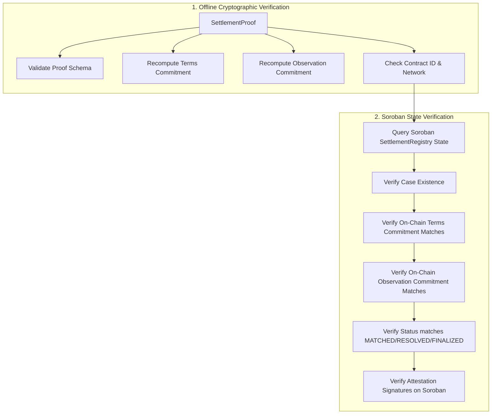

# Settlement Proof & Cryptographic Verification

A **Settlement Proof** (`SettlementProof`) is a self-contained, cryptographically verifiable artifact that proves a settlement instruction occurred, reconciled, and anchored to the Soroban smart contract according to strict protocol specifications.

---

## Proof Structure

```typescript
interface SettlementProof {
  version: "1.0.0";
  caseId: string;                // 32-byte hex case identifier
  termsCommitment: string;       // 32-byte hex SHA-256 hash of expected terms
  observationCommitment?: string;// 32-byte hex SHA-256 hash of observed settlement
  finalizedLedger: number;       // Stellar ledger sequence at finalization
  result: "MATCHED" | "BREAK";   // Final reconciliation outcome
  attestations: Array<{
    caseId: string;
    role: "OWNER" | "COUNTERPARTY" | "OBSERVER";
    attestor: string;            // Stellar StrKey (e.g. G...)
    commitment: string;          // 32-byte hex commitment
    attestedAtLedger: number;
  }>;
  contractId: string;            // Soroban SettlementRegistry Contract ID (C...)
  network: string;               // e.g. "testnet" or "public"
  generatedAt: string;           // ISO 8601 timestamp
}
```

---

## Canonical Commitment Rules

To guarantee that proofs generated across different languages, platforms, and runtime environments yield byte-identical hashes, StellarClear adheres to strict canonical formatting rules:

1. **Protocol Domain Prefixes**:
   - `STELLARCLEAR/TERMS/V1`
   - `STELLARCLEAR/OBSERVATION/V1`
   - `STELLARCLEAR/RESOLUTION/V1`
   - `STELLARCLEAR/DISPUTE/V1`
2. **Key Ordering Independence**: Object keys are deterministically sorted lexicographically before hashing.
3. **No Float Arithmetic**: Financial amounts are strictly formatted as decimal strings without exponent notations.
4. **UTF-8 Encoding**: All strings are normalized and encoded as standard UTF-8 bytes before SHA-256 hashing.
5. **No Raw `JSON.stringify`**: The serialization engine enforces deterministic canonical line formatting.

---

## Verification Pipelines

StellarClear provides two distinct layers of verification:



### Layer 1: Offline Verification (`POST /v1/proofs/verify`)

Validates the cryptographic integrity of the proof without network connectivity or RPC access:

1. Verifies proof schema conforms to `SettlementProofSchema`.
2. Recomputes terms commitment SHA-256 hash using the provided expected terms document and ensures it matches `proof.termsCommitment`.
3. Recomputes observation commitment SHA-256 hash using the observed document and ensures it matches `proof.observationCommitment`.
4. Confirms that `contractId` and `network` match expectations.

### Layer 2: Live On-Chain Verification (`POST /v1/proofs/verify/onchain`)

Executes complete offline cryptographic verification PLUS queries live Soroban smart contract state:

1. Runs complete Layer 1 offline cryptographic verification.
2. Queries `SettlementRegistry.get_case(case_id)` on Soroban via RPC.
3. Asserts the case exists on-chain.
4. Asserts that `contractCase.terms_commitment === proof.termsCommitment`.
5. Asserts that `contractCase.observation.observation_commitment === proof.observationCommitment`.
6. Asserts on-chain status matches reconciliation result (`MATCHED` or `FINALIZED`).
7. Queries each attestation record on-chain via `get_attestation` and ensures every signature and commitment matches.

---

## Verification Example (TypeScript SDK)

```typescript
import { verifySettlementProof } from "@stellarclear/proof";
import { StellarClearClient } from "@stellarclear/sdk";

// 1. Offline Verification
const result = verifySettlementProof(proof, {
  terms: expectedTerms,
  observation: observedSettlement,
  expectedContractId: "CAAAAAAAAAAAAAAAAAAAAAAAAAAAAAAAAAAAAAAAAAAAAAAAAAAAD2KM",
  expectedNetwork: "testnet",
});

if (!result.valid) {
  throw new Error(`Proof invalid: ${result.reason}`);
}

// 2. Online On-Chain Verification
const client = new StellarClearClient({
  network: "testnet",
  contractId: "CAAAAAAAAAAAAAAAAAAAAAAAAAAAAAAAAAAAAAAAAAAAAAAAAAAAD2KM",
  rpcUrl: "https://soroban-testnet.stellar.org",
});

const onChainCase = await client.registry.getCase(proof.caseId);
console.log("On-Chain Verified Case Status:", onChainCase.status);
```
